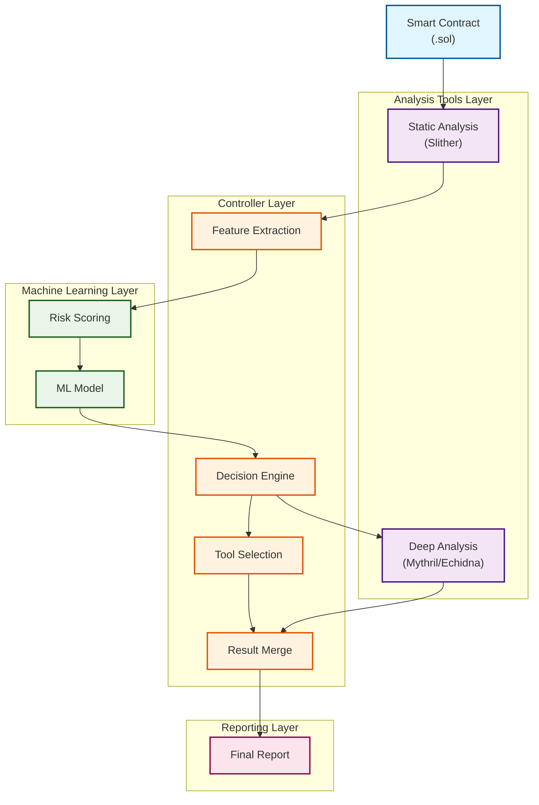

# HySCAV Architectural Diagram

```mermaid
flowchart TD
    A["Smart Contract<br/>(.sol)"] --> B["Static Analysis<br/>(Slither)"]
    B --> C["Feature Extraction"]
    C --> D["Risk Scoring"]
    D --> E["ML Model"]
    E --> F["Decision Engine"]
    F --> G["Tool Selection"]
    G --> H["Result Merge"]
    H --> I["Final Report"]

    F --> J["Deep Analysis<br/>(Mythril/Echidna)"]
    J --> H

    subgraph Analysis_Tools_Layer ["Analysis Tools Layer"]
        B
        J
    end

    subgraph Controller_Layer ["Controller Layer"]
        C
        F
        G
        H
    end

    subgraph ML_Layer ["Machine Learning Layer"]
        D
        E
    end

    subgraph Reporting_Layer ["Reporting Layer"]
        I
    end

    classDef inputClass fill:#e1f5fe,stroke:#01579b,stroke-width:2px
    classDef analysisClass fill:#f3e5f5,stroke:#4a148c,stroke-width:2px
    classDef controllerClass fill:#fff3e0,stroke:#e65100,stroke-width:2px
    classDef mlClass fill:#e8f5e8,stroke:#1b5e20,stroke-width:2px
    classDef reportClass fill:#fce4ec,stroke:#880e4f,stroke-width:2px

    class A inputClass
    class B,J analysisClass
    class C,F,G,H controllerClass
    class D,E mlClass
    class I reportClass
```
